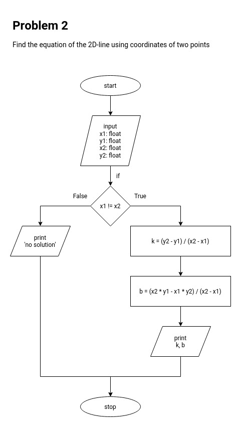
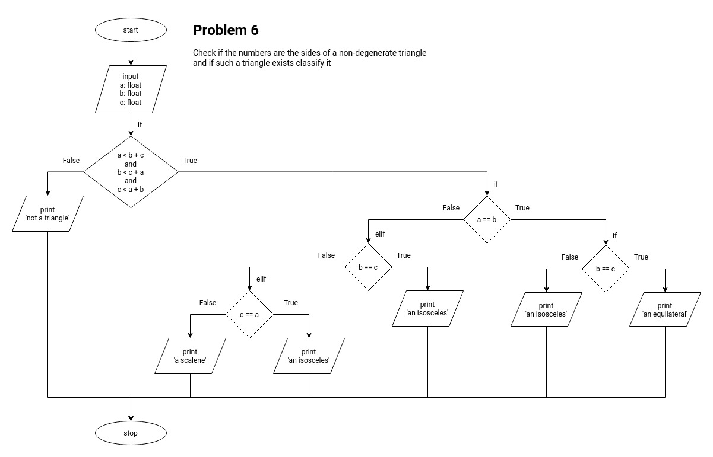
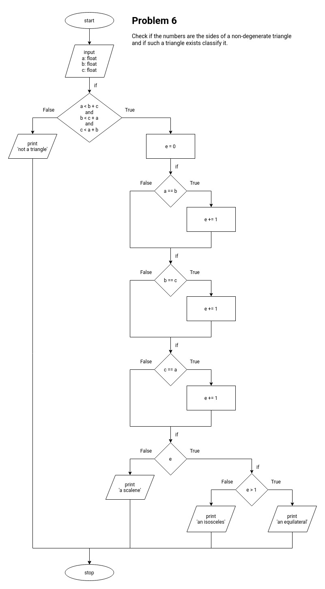
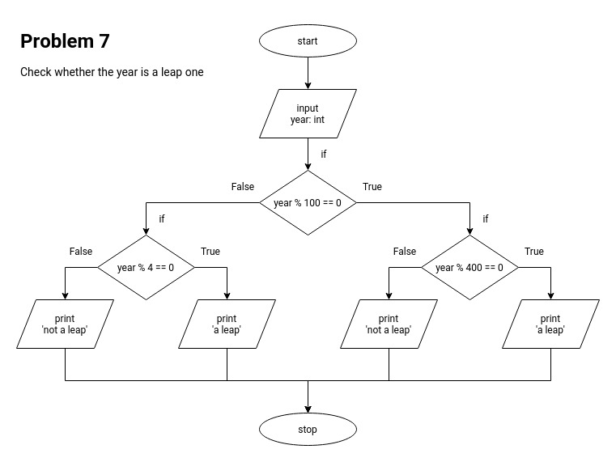
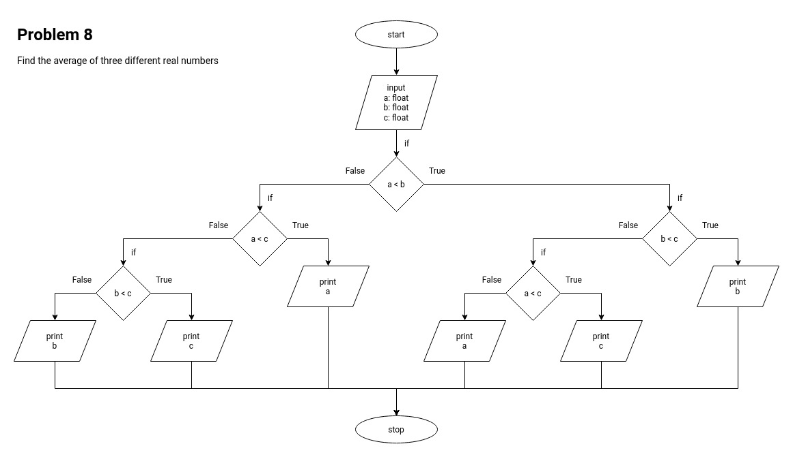
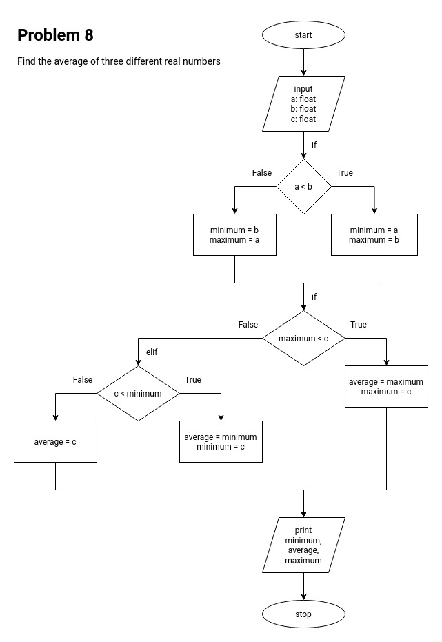

# Урок 1. Введение в алгоритмизацию и простые алгоритмы на Python

## Практическое задание

Для каждого упражнения необходимо
составить графическое представление алгоритма в виде блок-схемы и
написать программную реализацию.

Блок-схемы можно делать на сайте [draw.io][drawio] (рекомендуется) или
в любом другом редакторе.
При работе в [draw.io][drawio] должен быть один файл,
при этом блок-схема для каждой задачи рисуется на новом листе.
Прилагаемая ссылка должна быть доступна для просмотра,
иначе следует присылать архив с блок-схемами в формате _.pdf_ или _.jpg_.

Код следует писать в файлах с расширением _.py_ в кодировке _UTF-8_
(в [PyCharm][pycharm] работает по умолчанию).
Каждую задачу необходимо сохранять в отдельный файл.
В начале каждого файла следует вставить текст задачи в виде комментария к коду.
Имя файла с кодом должно совпадать с именем листа в [draw.io][drawio],
содержащего соответствующую блок-схему.
Рекомендуется использовать англоязычные имена,
например, _les_1_task_1_, _les_1_task_2_, и т.д.

Для оценки 'Отлично' достаточно выполнить _4_ любых задания на выбор,
причем оценка ставится за работы без ошибок.
К примеру, если из _6_ сданных задач _2_ выполнены неверно,
оценка не может быть отличной.

### Задачи

1. Выполнить логические побитовые операции 'и', 'или' и другие
над числами _5_ и _6_.
Выполнить над числом _5_ побитовый сдвиг вправо и влево на два знака.

2. По введенным пользователем координатам двух точек
вывести уравнение прямой вида _y = kx + b_, проходящей через эти точки.

3. Написать программу, которая генерирует в указанных пользователем границах:
случайное целое число, случайное вещественное число, случайный символ.
Для каждого из трех случаев пользователь задает свои границы диапазона.  
Например, если надо получить случайный символ от 'a' до 'f',
то вводятся эти символы,
после чего программа должна вывести на экран
любой символ алфавита от 'a' до 'f' включительно.

4. Пользователь вводит две буквы.
Определить, на каких местах алфавита они стоят, и
сколько между ними находится букв.

5. Пользователь вводит номер буквы в алфавите. Определить, какая это буква.

6. По длинам трех отрезков, введенных пользователем,
определить возможность существования треугольника,
составленного из этих отрезков.
Если такой треугольник существует, то определить,
является ли он разносторонним, равнобедренным или равносторонним.

7. Определить, является ли год,
который ввел пользователь, високосным или невисокосным.

8. Вводятся три разных числа.
Найти, какое из них является средним (больше одного, но меньше другого).

### Примечания

- Во всех заданиях, где речь идёт о буквах алфавита, решения необходимы
только для строчных букв латинского алфавита от 'a' до 'z'.

- Попытайтесь решить задания без использования циклов и собственных функций
(они будут рассматриваться на уроке 2),
а также без массивов (они будут рассматриваться на уроке 3).
Зарезервированные слова `for` и `while` считаются циклом,
`def` - функцией, квадратные скобки `[` и `]` - массивами.
Их наличие в коде расценивается как неверное решение.

- Договариваемся об идеальном пользователе,
который вводит только верные данные, требуемые программой.
Проверка ввода не обязательна.

- Уделите время в первую очередь построению графического алгоритма,
а затем - написанию кода по этому алгоритму. Не наоборот.

### Решение

- [ ] Задача 1

- [x] Задача 2. Файлы:
  - problem_2.py
  - problem_2.jpg  
    

- [ ] Задача 3

- [ ] Задача 4

- [ ] Задача 5

- [x] Задача 6. Файлы:
  - problem_6_1.py
  - problem_6_1.jpg  
    
  - problem_6_2.py
  - problem_6_2.jpg  
    

- [x] Задача 7. Файлы:
  - problem_7.py
  - problem_7.jpg  
    

- [x] Задача 8. Файлы:
  - problem_8_1.py
  - problem_8_1.jpg  
    
  - problem_8_2.py
  - problem_8_2.jpg  
    

[drawio]: https://app.diagrams.net/
[pycharm]: https://www.jetbrains.com/pycharm/
