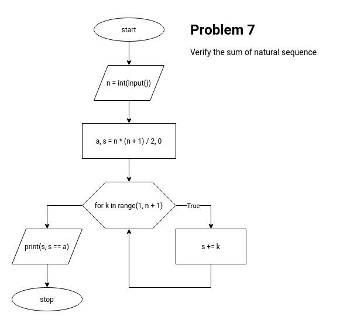

# Урок 2. Циклы, рекурсия, функции

## Практическое задание

Для каждого упражнения необходимо
составить графическое представление алгоритма в виде блок-схемы и
написать программную реализацию.

Блок-схемы можно делать на сайте [draw.io][drawio] (рекомендуется) или
в любом другом редакторе.
При работе в [draw.io][drawio] должен быть один файл,
при этом блок-схема для каждой задачи рисуется на новом листе.
Прилагаемая ссылка должна быть доступна для просмотра,
иначе следует присылать архив с блок-схемами в формате _.pdf_ или _.jpg_.

Код следует писать в файлах с расширением _.py_ в кодировке _UTF-8_
(в [PyCharm][pycharm] работает по умолчанию).
Каждую задачу необходимо сохранять в отдельный файл.
В начале каждого файла следует вставить текст задачи в виде комментария к коду.
Имя файла с кодом должно совпадать с именем листа в [draw.io][drawio],
содержащего соответствующую блок-схему.
Рекомендуется использовать англоязычные имена,
например, _les_1_task_1_, _les_1_task_2_, и т.д.

Для оценки 'Отлично' достаточно выполнить _4_ любых задания на выбор,
причем оценка ставится за работы без ошибок.
К примеру, если из _6_ сданных задач _2_ выполнены неверно,
оценка не может быть отличной.

### Задачи

1. Написать программу, которая будет складывать, вычитать,
умножать или делить два числа.
Числа и знак операции вводятся пользователем.
После выполнения вычисления программа не завершается,
а запрашивает новые данные для вычислений.
Завершение программы должно выполняться
при вводе символа '0' в качестве знака операции.
Если пользователь вводит неверный знак (не '0', '+', '-', '_', '/'),
программа должна сообщать об ошибке и снова запрашивать знак операции.
Также она должна сообщать пользователю о невозможности деления на ноль,
если он ввел его в качестве делителя.

2. Посчитать четные и нечетные цифры введенного натурального числа.
Например, если введено число _34560_,
в нем _3_ четные цифры (_4_, _6_ и _0_) и _2_ нечетные (_3_ и _5_).

3. Сформировать из введенного числа обратное по порядку входящих в него цифр
и вывести на экран.
Например, если введено число _3486_, надо вывести _6843_.

4. Найти сумму _n_ элементов следующего ряда чисел
_1_, _-0.5_, _0.25_, _-0.125_,...
Количество элементов (_n_) вводится с клавиатуры.

5. Вывести на экран коды и символы таблицы ASCII,
начиная с _32_-го символа и заканчивая _127_-м включительно.
Вывод выполнить в табличной форме: по десять пар «код-символ» в каждой строке.

6. В программе генерируется случайное целое число от _0_ до _100_.
Пользователь должен его отгадать не более чем за _10_ попыток.
После каждой неудачной попытки должно сообщаться,
больше или меньше введенное пользователем число, чем то, что загадано.
Если за _10_ попыток число не отгадано, вывести ответ.

7. Написать программу, доказывающую или проверяющую,
что для множества натуральных чисел выполняется равенство:
_1 + 2 + ... + n = n (n + 1) / 2_,
где _n_ — любое натуральное число.

8. Посчитать, сколько раз встречается определенная цифра
в введенной последовательности чисел.
Количество вводимых чисел и цифра, которую необходимо посчитать,
задаются вводом с клавиатуры.

9. Среди натуральных чисел, которые были введены,
найти наибольшее по сумме цифр.
Вывести на экран это число и сумму его цифр.

### Примечания

- В заданиях _2_, _3_, _4_, _7_, _8_, _9_
пользователь вводит только натуральные числа.

- Попытайтесь решить задания без использования массивов в любых вариациях
(массивы будут рассмотрены на следующем уроке).
Любые квадратные скобки `[` и `]` считаются массивами и
их наличие в коде расценивается как неверное решение.

- Договариваемся об идеальном пользователе,
который вводит только верные данные, требуемые программой.
Проверка ввода не обязательна.

- Уделите это время в первую очередь построению графического алгоритма,
а затем написанию кода по этому алгоритму. Не наоборот.

### Решение

- [x] Задача 1. Файлы:
  - problem_1.py
  - problem_1.jpg  
    

- [x] Задача 2. Файлы:
  - problem_2.py
  - problem_2.jpg  
    

- [x] Задача 3. Файлы:
  - problem_3.py
  - problem_3.jpg  
    

- [x] Задача 4. Файлы:
  - problem_4_1.py
  - problem_4_1.jpg  
    
  - problem_4_2.py
  - problem_4_2.jpg  
    
  - problem_4_3.py
  - problem_4_3.jpg  
    

- [x] Задача 5. Файлы:
  - problem_5.py
  - problem_5.jpg  
    

- [x] Задача 6. Файлы:
  - problem_6.py
  - problem_6.jpg  
    

- [x] Задача 7. Файлы:
  - problem_7.py
  - problem_7.jpg  
    

- [x] Задача 8. Файлы:
  - problem_8.py
  - problem_8.jpg  
    

[drawio]: https://app.diagrams.net/
[pycharm]: https://www.jetbrains.com/pycharm/
